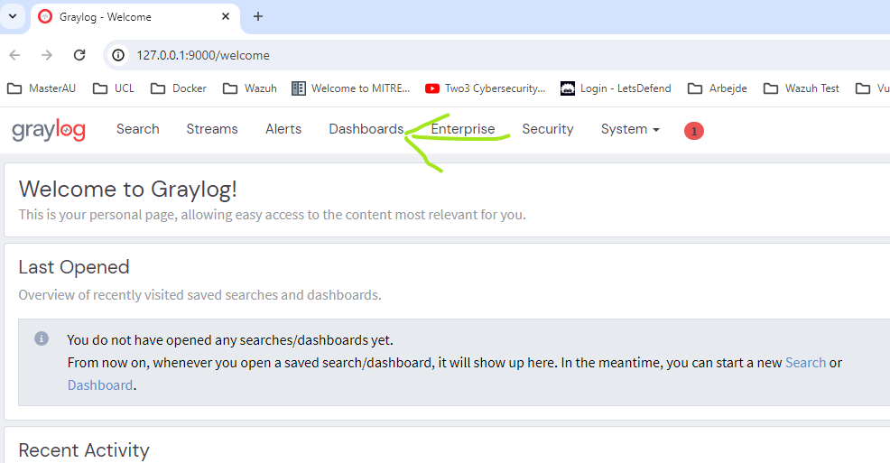
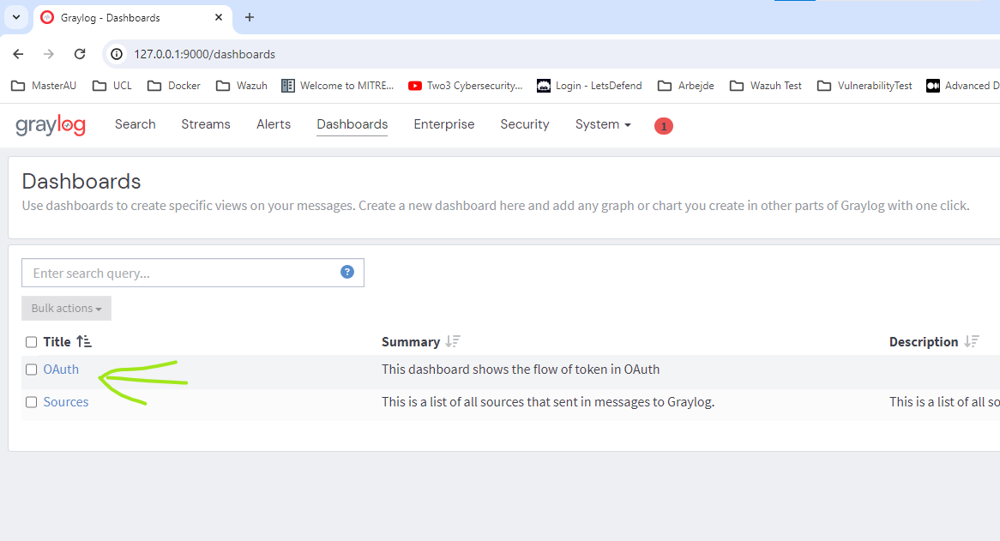
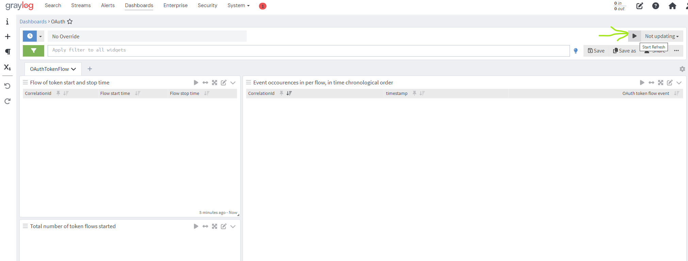
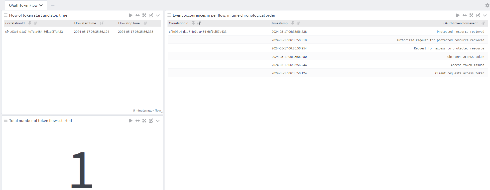

# Visualisation of Token and authorization  grants.
This project aims to create a visualization of the flow of tokens when using OAuth. 
This project uses [IdentityServer](https://duendesoftware.com/products/identityserver) for OAuth functionallity, but should  **never be used as an example of how to configure Identity server**.
In fact this project **disregards most security aspects of the Identity server configuration**. For examples of proper Identity server, please referer
to [IdentityServer4 documentation](https://docs.duendesoftware.com/identityserver/v7). The sole purpose of this project is to demonstrate the flows
in OAuth.

## Running the project
The services can be deployed as a unit pr. service by deploying the services directly onto the OS, 
or the services can be deployed as a single unit, by using [docker compose](https://docs.docker.com/compose/). Using docker compose is the recommend approach for this project,
an is the only deployment that also provides graylog.

  
Because this project serves educational purpose only, it is only intended to be deploy to a local desktop, where the user can experiment.

### Quick start
Clone this repository, and from the root of the repository folder, execute the command ```Docker compose up```- Await the start of all
the services, and then enter the graylog  GUI URL at [127.0.0.1:9000](http://127.0.0.1:9000) and login the credentials Username: _admin_ and password:_admin_.
In the Graylog GUI, click _Dashboards_.

  
  
Once you have entered the dash boards, select the _OAuth_ dashboard  
  
  
  
You will now be presented with 7 different aggregation. Click the start refresh in the upper right corner.  
  
  
  
Finally initiate a request for a protected resource, by sending a HTTP GET request to the client service at the path `/ClientCredentialGrant`.
Here is an example of the request cURL from windows powershell: ```curl 'http://localhost:5003/ClientCredentialGrant'```. The Graylog dashboard,
should now show values in the all of the token flow aggregations. 


### Docker compose
Executing the command ```Docker compose up``` in the root of this project folder, will use the `docker-compose.yml` file to deploy this entire project.
Afterwards the [client service API](#client) will be exposed on port 5003.
  
The docker compose file also includes the graylog stack.

The docker compose file can be viewed  in the [docker-compose.yml](./docker-compose.yml) located in the repository root folder.

_Beware: There is a dependency towards the folder GraylogContentsPacks located in the root of the project folder._

### Unit pr service
The application can be deployed as a unit pr. services. Each service must be deploy using the [dotnet cli tool](https://learn.microsoft.com/en-us/dotnet/core/tools/).
The services can be deployed by executing the commands shown below. The shown order of the commands, is also the recommended order for deployment:

- ```dotnet run --project .\msdo.oauth.identityServer\ --ConfigurationFile=Local.json```
- ```dotnet run --project .\msdo.oauth.protectedResource\ --ConfigurationFile=Local.json```
- ```dotnet run --project .\msdo.oauth.client\ --ConfigurationFile=Local.json```


### Configuring the services
All services are configured to configuration files located in each services project folder, in the folder _ConfigurationFiles_

By default, a configuration file that should be used with docker compose is provide. The file is located in the root folder of
each service project. The file name is _DockerCompose.json_.

There is also a configuration file for each service, that should be used when deploying the services separate  called _Local.json_

*The enviroment, regardless of the chosen deployment method, is only meant to be deployed on a single host*

## Using Graylog
When deploying the environment with docker compose, the graylog stack is also deployed. Graylog is deployed with preconfigured
input, rules and dashboard, for tracking of the OAuth token flow.
  
The graylog content pack used for the predefined input,rules and dashboard, can be found in [./GraylogContentPacks/inputConfiguration.json](./GraylogContentPacks/inputConfiguration.json)


## Information on services in this project
This section presents an overview of all the services in this project. The table below presents a general overview of all services in this project.

| Service name                                      | Purpose                                                           |Implementation                                                           |
|---------------------------------------------------|-------------------------------------------------------------------|-------------------------------------------------------------------|
| Client | Is the client service, that need access to a protected resource | [msdo.oauth.client](./msdo.oauth.client) |
| Protected Resource service | The resource service with protected resources | [msdo.oauth.protectedResource](./msdo.oauth.protectedResource) |
| Identity service | The Authorization service that provides access token for protected resources | [msdo.oauth.identityServer](./msdo.oauth.identityServer) |

### Services Network ports
The services usage of network ports are persistant, regardless if deployment are made to a local OS, or using docker compose,
the table below provides a full overview of ports used by each service.
| Service name                                      | Port                                                           |
|---------------------------------------------------|-------------------------------------------------------------------|
| Client | Port 5003, used for http traffic  |
| Protected Resource server | Port 5002, used for http traffic |
| Identity Server | Port 5001, used for http traffic|

### Services endpoints
This section presents all the endpoints exposed by the services. Except for identity server. Only
the Endpoints used in this project is presented for identity server


#### Client

| Path                                      | Purpose                                                           | HTTP Method | Link to service OpenApi specifications |
|-------------------------------------------|-------------------------------------------------------------------|-------------|---------------------------------------|
| `/ClientCredentialGrant`                 | Uses client credential grant to obtain a valid accessToken, and then requests a protected resource | GET         | Yet to come                           |


#### Protected resource server
| Path                  | Purpose                                                           | HTTP Method | Link to service OpenApi specifications |
|-----------------------|-------------------------------------------------------------------|-------------|---------------------------------------|
| `/Resource`           | Provides a protected resource, if a valid access token is presented | GET         | Yet to come                           |


#### Identity server
| Path                                      | Purpose                                                           | HTTP Method | Link to service OpenApi specifications |
|-------------------------------------------|-------------------------------------------------------------------|-------------|---------------------------------------|
| `/.well-known/openid-configuration`       | Retrieves OpenID Connect configuration details for authentication. See [documentation](https://identityserver4.readthedocs.io/en/latest/endpoints/discovery.html) | GET         | Yet to come                           |
| `/connect/token`                          | Used to request tokens. See [documentation](https://identityserver4.readthedocs.io/en/latest/endpoints/token.html)  | POST        | Yet to come                           |